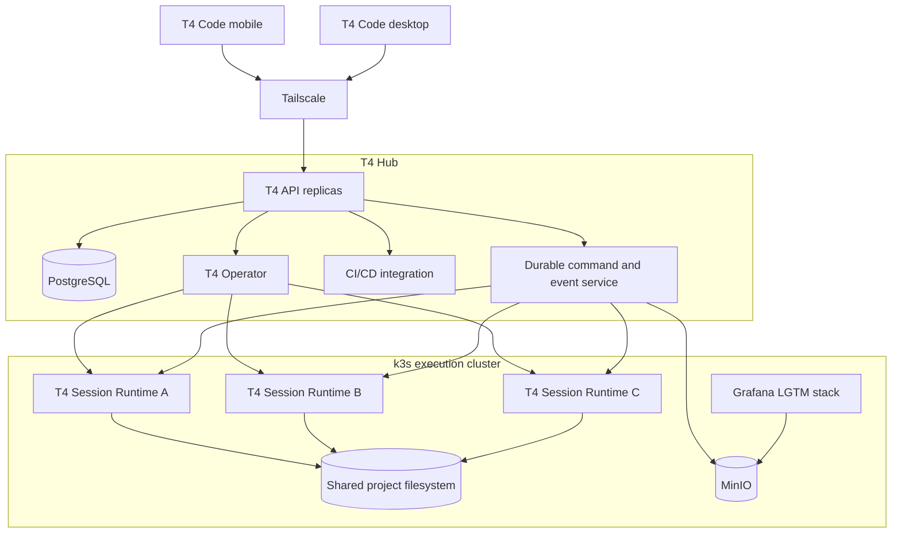

# T4 Hub architecture

## Status

This document defines the accepted direction for the managed T4 Code platform on `feat/t4-hub`. It replaces the long-term assumption that T4 remotely controls an arbitrary OMP process installed on a user's desktop.

The current Flutter client is the product and interaction baseline. The current local host service, host wire protocol, OMP fork launcher, and private OMP authority adapter remain temporary compatibility and test references until the managed path passes its replacement gates. They are then removed rather than retained as a second production authority.

## Product goal

T4 Code is a remote client for an easy-to-install, highly available agent platform:

```text
T4 Code desktop or mobile
        |
        | authenticated Hub Wire over Tailscale
        v
T4 Hub control plane
        |
        | durable commands and desired state
        v
k3s cluster and T4 Operator
        |
        | one managed runtime pod per OMP session
        v
Pinned stock OMP runtime
        |
        | shared POSIX project filesystem
        v
Repositories, worktrees, and project services
```

T4 Hub integrates source control and CI/CD activity into the same durable session history and presents progress in the Flutter GUI. A user can begin with one Linux machine and expand the same installation to a three-or-more-node HA cluster.

## Product names

| Name                   | Responsibility                                                                                                                                                                                      |
| ---------------------- | --------------------------------------------------------------------------------------------------------------------------------------------------------------------------------------------------- |
| **T4 Code**            | Flutter desktop, mobile, and web client. It is a remote client even when the Hub is nearby.                                                                                                         |
| **T4 Hub**             | Logical control plane: API, authentication, durable state, scheduling intent, CI/CD integrations, updates, and cluster health. In HA mode it is distributed, not installed on one special computer. |
| **T4 Node**            | A Linux machine enrolled into the k3s cluster to provide control-plane, storage, or execution capacity.                                                                                             |
| **T4 Operator**        | Kubernetes controller that reconciles durable T4 session intent into runtime pods and related resources.                                                                                            |
| **T4 Session Runtime** | Internal OCI image containing the T4 runtime adapter and a pinned, unmodified official OMP release.                                                                                                 |

Users interact with T4 Code, T4 Hub, and T4 Node. Kubernetes, containerd, PostgreSQL replication, storage placement, and telemetry topology are implementation details managed by the installer.

## Architectural invariants

1. PostgreSQL is authoritative for projects, sessions, commands, ownership epochs, approvals, progress events, and CI/CD associations.
2. Kubernetes reconciles execution resources; Kubernetes objects are not the product event database.
3. T4 creates every managed OMP session and therefore knows its legitimate owner from creation.
4. Each accepted command is durable and idempotent before a runtime receives it.
5. Each session has one current owner epoch. A stale runtime cannot claim commands or publish accepted state after ownership transfers.
6. Runtime pods are disposable. Sessions, worktrees, commands, and user-visible history survive pod replacement.
7. All runtimes for a project mount the same networked POSIX filesystem at the same absolute path.
8. OMP owns repositories, Git worktrees, and its agent behavior inside the managed runtime. T4 does not invent a competing worktree model.
9. T4 Code speaks only the versioned Hub protocol. It never depends on Kubernetes resources or direct pod connections.
10. Development, single-node, and HA installations use the same images, migrations, protocol, and release chart. Profiles alter topology rather than behavior.
11. No deployment is described as HA until it has at least three suitable failure domains and passes automated recovery checks.
12. Product progress is durable application state. Grafana telemetry supplements it but never replaces it.

## System topology



### T4 Hub placement

In a single-node installation, the one Linux machine is both T4 Hub and T4 Node. In an HA installation, Hub API, database, operator, storage, and telemetry replicas are distributed across the cluster. Clients use one stable Tailnet service address and do not select a control-plane replica.

A Linux machine may be a dedicated mini PC, home or office server, NAS-hosted VM, cloud VM, or Linux workstation. macOS and Windows run T4 Code as remote clients. A managed local Linux VM may be added later, but the initial server and node implementation remains Linux-only.

## Protocol boundaries

The managed architecture does not preserve the current local `@t4-code/host-wire` contract wholesale.

### Hub Wire

`@t4-code/hub-wire` is the external, versioned T4 Code-to-Hub contract. It covers:

- pairing, authentication, devices, and capabilities;
- projects, workspaces, repositories, and sessions;
- prompt, steer, follow-up, cancellation, and attention responses;
- bounded transcript, file, artifact, and image access;
- durable progress cursors and reconnection;
- cluster and node health;
- CI/CD runs, checks, reviews, artifacts, and deployment approvals;
- backup, update, and compatibility status.

The current protocol's bounded decoding, branded identifiers, additive evolution, command idempotency, paging, and payload limits should be migrated when their semantics remain correct. Local host discovery, external session attachment, local transcript observation, and competing process ownership must not leak into Hub Wire.

### Runtime Wire

`@t4-code/runtime-wire` is the internal Hub-to-session-runtime contract. It covers:

- runtime registration and compatibility;
- session identity, runtime image digest, and owner epoch;
- durable command claiming and outcomes;
- OMP prompt, steer, follow-up, cancellation, and approval operations;
- ordered transcript and progress publication;
- heartbeat, lease renewal, recovery checkpoint, completion, and failure.

A runtime may only claim work or publish authoritative outcomes for its current epoch. Losing the lease makes it terminate or become inert immediately.

### OMP boundary

The T4 Session Runtime launches a pinned official OMP release and adapts its supported appserver or RPC interface to Runtime Wire. T4 owns the containing runtime and starts the OMP session, so there is no second desktop process competing for ownership.

If an official OMP release lacks a required public capability, T4 should propose the narrow capability upstream. A broad patched desktop OMP distribution is not part of the target architecture.

## Current-code disposition

### Retained and evolved

- The shared Flutter client, adaptive GUI, secure Hub directory, session UX, transcript rendering, composer, attention inbox, developer surfaces, and lifecycle behavior.
- Observable user workflows and deterministic fixtures that remain valid.
- Bounded protocol and projection techniques.
- Capability negotiation, command IDs, paging cursors, payload limits, and fail-closed decoding where their meanings survive.

### Replaced after proof

- Local OMP discovery and process probing.
- External-session observation and attachment as the primary managed path.
- RPC-child spawning on an arbitrary desktop host.
- Local JSONL transcript discovery and compatibility projection.
- Competing-process lock inspection and takeover behavior.
- The current OMP fork launcher and private authority adapter.
- Host-specific workspace authority and local appserver deployment.

Replacement is gated. The current backend is not deleted until the managed path completes the real session, recovery, storage, client, and rollback gates defined below.

## Session and command flow

```text
T4 Code submits command with commandId
  -> T4 Hub authenticates and validates it
  -> PostgreSQL records the command durably
  -> current session owner claims it with ownerEpoch
  -> T4 runtime adapter invokes stock OMP
  -> runtime records accepted, rejected, or failed outcome
  -> transcript and progress events are durably appended
  -> T4 Code receives events and advances its cursor
```

A lost client connection cannot lose an accepted command. Retrying the same command ID cannot execute it twice. A client can always distinguish pending, accepted, rejected, completed, failed, and unknown-after-invariant-violation states.

### Session recovery

When a runtime pod fails:

1. Its lease expires or the controller revokes it.
2. T4 advances the owner epoch.
3. The old runtime is fenced and terminated.
4. The operator creates a replacement runtime using the same pinned image and worktree path.
5. The replacement mounts the shared project filesystem.
6. It restores the durable session checkpoint and resumes command/event cursors.
7. The GUI moves from `Recovering` to `Ready` only after continuity is verified.

## Shared project filesystem

All eligible execution nodes mount the same project filesystem at a stable path:

```text
/workspace/projects/<project-id>/
├── repo/
├── worktrees/
├── shared/
└── .t4/
```

OMP manages repositories and worktrees on this filesystem. Multiple sessions may use distinct OMP-managed worktrees concurrently while seeing the same project environment. Repository-global mutations must retain OMP/Git locking semantics and pass the storage conformance suite.

The live filesystem requires POSIX behavior, RWX mounting, atomic rename, exclusive file creation, symlinks, reliable permissions, recovery after node loss, snapshots, and acceptable metadata performance.

Rook-managed CephFS is the selected live shared filesystem. T4 provisions one CephFS subvolume or equivalent isolation boundary per project and mounts it through the Ceph CSI driver as RWX storage. Ceph placement must use explicit nodes and devices; the installer never consumes an unapproved disk automatically.

A single-node profile runs one nonredundant Ceph monitor, manager, metadata service, and size-one data/metadata pools. The GUI labels this state as unprotected and requires the user to select suitable Ceph storage. When two additional storage nodes join, T4 distributes monitors, enables a standby metadata service, changes pool placement to the host failure domain, raises replication to three, waits for backfill, and reports HA only after Ceph returns healthy.

CephFS remains subject to a representative conformance suite covering real OMP worktree concurrency, large repositories, package trees, pod and node failure, expansion from one to three nodes, metadata-service failover, pool backfill, snapshot, restore, and `git fsck` integrity. This validates the selected implementation rather than reopening the provider decision.

MinIO is object storage rather than the live POSIX filesystem. It stores artifacts, uploads, transcript and log chunks, filesystem backups, database backups, and observability objects.

## Technology stack

| Layer                | Selected technology                                                                                                                           |
| -------------------- | --------------------------------------------------------------------------------------------------------------------------------------------- |
| Client               | Flutter for macOS, Windows, Linux, Android, iOS, and Web where appropriate                                                                    |
| Private network      | Tailscale and the Tailscale Kubernetes Operator; Headscale remains a possible self-hosted control-plane option subject to compatibility proof |
| Cluster              | k3s using standard Kubernetes APIs                                                                                                            |
| Container runtime    | containerd                                                                                                                                    |
| Build artifact       | OCI images built without requiring Docker or Docker Desktop                                                                                   |
| Control API          | T4 Hub service, preserving existing implementation-language conventions until profiling or correctness requires a change                      |
| Reconciler           | T4 Kubernetes Operator                                                                                                                        |
| Agent runtime        | T4 runtime adapter plus a pinned official OMP release                                                                                         |
| Product database     | PostgreSQL managed by CloudNativePG in HA mode                                                                                                |
| Shared filesystem    | Rook-managed CephFS exposed through the Ceph CSI driver as RWX project storage                                                                |
| Object storage       | MinIO Community Edition                                                                                                                       |
| Source workflow      | Git and OMP-managed Git worktrees                                                                                                             |
| CI/CD                | GitHub App, webhooks, Checks/Actions APIs, and self-hosted runners where appropriate                                                          |
| Dashboards           | Grafana OSS                                                                                                                                   |
| Telemetry collection | Grafana Alloy                                                                                                                                 |
| Metrics              | Grafana Mimir                                                                                                                                 |
| Logs                 | Grafana Loki                                                                                                                                  |
| Traces               | Grafana Tempo                                                                                                                                 |
| Instrumentation      | OpenTelemetry                                                                                                                                 |
| Secrets              | External Secrets with OpenBao or SOPS; avoid making current Vault BUSL releases a required dependency                                         |

The self-hosted software stack can operate without software license fees, subject to the applicable open-source and source-available licenses. Tailscale's hosted control plane, GitHub plans, hardware, bandwidth, store accounts, and operational support may incur costs. AGPL components must remain license-compliant, especially if modified or redistributed.

## Deployment profiles

T4 Code presents a guided deployment configurator. Users choose availability goals and machines; they do not manually place databases, storage services, or operator replicas.

### Local single-node

One Linux computer runs T4 Hub, one T4 Node, and all session runtimes.

**Benefits**

- No additional machine.
- Simplest supported installation.
- Same k3s, protocol, operator, and runtime architecture as larger deployments.

**Limitations**

- Stops when the computer sleeps, shuts down, or fails.
- No hardware redundancy.
- Agent work competes with desktop workloads.
- External backup is strongly recommended.

### Remote single-node

One always-on Linux computer or VM runs T4 Hub and T4 Node. Desktop and mobile clients connect over Tailscale.

**Benefits**

- Recommended personal configuration.
- Work continues while client devices are off.
- Can expand into the intended cluster topology.

**Limitations**

- Still one failure domain.
- Unavailable during host maintenance or failure.

### Highly available cluster

At least three suitable Linux machines run k3s with embedded-etcd quorum, distributed Hub replicas, PostgreSQL replicas, replicated storage, and schedulable runtime capacity.

**Benefits**

- Survives a tested single-node failure.
- Adds execution capacity and replicated state.
- Supports teams and continuous workloads.

**Limitations**

- Requires at least three failure domains.
- Needs greater disk, memory, and network capacity.
- Replication does not replace backups.

Two nodes may add capacity but are not labeled HA because they cannot preserve quorum after an arbitrary partition.

### Advanced installation

An explicit advanced path may support an existing k3s cluster, dedicated control/storage/worker roles, external PostgreSQL or object storage, custom storage classes, and specialized runner pools. Unsupported combinations must be rejected rather than accepted optimistically.

## Guided installation

### First Hub

```text
Install T4 Code
  -> choose local Linux or remote Linux Hub
  -> discover or identify the machine through Tailscale
  -> run the signed T4 Node installer
  -> exchange a short-lived, single-use enrollment code
  -> validate CPU, memory, disk, OS, network, and time
  -> install k3s and the signed T4 release bundle
  -> bootstrap PostgreSQL, storage, MinIO, and Grafana
  -> run an end-to-end session health check
  -> pair T4 Code
```

Users do not run `kubectl`, edit Helm values, manage database credentials, or place replicas manually.

### Cluster expansion

The GUI exposes `Make highly available` or `Add node`. T4 enrolls additional Linux machines, expands embedded-etcd quorum, creates PostgreSQL and storage replicas, expands or migrates MinIO safely, adds Hub replicas, rebalances workloads, and runs failure checks before reporting HA.

The client endpoint, project identifiers, session history, worktree paths, and credentials remain stable during expansion.

### Configuration UX

The configurator shows a topology preview and plain-language consequences:

```text
Availability: Single-node
Database copies: 1
Workspace copies: 1
External backup: Not configured
Recommendation: Add two Linux nodes for high availability.
```

Ordinary users choose among versioned, tested profiles. Arbitrary independent replica counts and service placements remain an advanced operator concern.

## CI/CD and product progress

A GitHub App integrates repository authorization, webhooks, branches, pull requests, checks, workflow state, reviews, artifacts, deployment environments, and approvals.

OMP and integrations emit typed product events such as:

```text
session.created
runtime.started
message.accepted
tool.started
files.changed
commit.created
tests.started
tests.completed
pull_request.opened
ci.check.updated
approval.requested
deployment.completed
session.recovered
```

These events are persisted and shown in T4 Code. The GUI does not infer authoritative progress by scraping terminal text or querying Grafana.

## Observability

The self-hosted Grafana LGTM stack is:

- Grafana for dashboards and alerts;
- Grafana Alloy for collection;
- Grafana Mimir for metrics;
- Grafana Loki for logs;
- Grafana Tempo for traces;
- OpenTelemetry for T4 instrumentation;
- MinIO as object storage for Mimir, Loki, and Tempo.

No Prometheus server is required. Alloy may scrape Prometheus-format metrics exposed by Kubernetes and its components.

Single-node installations use compact, bounded-retention deployments. HA installations may use distributed deployments. Observability failure cannot prevent session execution or alter durable product state.

## Security boundaries

- Hub APIs are Tailnet-only by default.
- Device pairing produces scoped credentials and capabilities.
- Node enrollment uses short-lived, single-use credentials and establishes durable mTLS identity.
- Runtime pods receive only project- and session-scoped authority.
- No runtime pod receives unrestricted Kubernetes API credentials.
- Repository code is treated as untrusted: workloads require resource limits, network policy, controlled egress, and stronger sandboxing where the threat model requires it.
- Secrets use workload identity or short-lived delivery and never enter transcripts, logs, images, support bundles, or repository files.
- Support bundles are bounded and redacted by construction.
- Every release includes signed OCI images, an SBOM, checksums, schema compatibility, and a supported-version manifest.

## Delivery strategy

Work proceeds on `feat/t4-hub`, branched from the verified Flutter collaboration baseline. `feat/flutter-rewrite` remains the stable client branch. The new branch must not turn the current host service into a disguised cluster control plane.

### Foundation contract

Define Hub Wire, Runtime Wire, the session state machine, PostgreSQL ownership, owner-epoch fencing, stable filesystem paths, runtime compatibility, and the versioned deployment profile format.

### First production-shaped vertical slice

Prove one complete path using real components:

1. T4 Code connects to a compact single-node k3s deployment.
2. T4 Hub persists a project, session, and prompt in PostgreSQL.
3. T4 Operator starts a real T4 Session Runtime.
4. The runtime launches pinned stock OMP.
5. OMP changes a file in its shared-filesystem worktree.
6. T4 Code renders durable progress.
7. Deleting the runtime pod triggers bounded recovery against the same worktree.
8. Reconnection does not duplicate the prompt or lose transcript continuity.

Development, CI, single-node, and HA profiles use one versioned release chart. A developer profile may use a managed Linux VM running real k3s; Docker, Docker Desktop, k3d, and a separate Docker Compose architecture are not required.

### CephFS qualification

Prove the packaged Rook/CephFS topology in single-node and HA profiles. Qualification includes explicit device enrollment, CSI mounting, OMP worktree concurrency, metadata-service failover, expansion from size-one pools to host-distributed size-three pools, backfill observability, snapshots, restore, and Git integrity. T4 Code and Hub Wire remain independent of Ceph-specific administration even though the packaged platform standardizes on CephFS.

### HA expansion

Prove three-node k3s quorum, Hub API replication, operator leader replacement, CloudNativePG failover, object and filesystem replication, and stable Tailnet routing.

### CI/CD integration

Add GitHub and self-hosted runner integration only after command durability and workspace recovery work independently.

### Guided installer

Package T4 Hub and T4 Node installation, expansion, backup, update, rollback, and support collection behind the Flutter setup UI. Installer automation uses the same signed release bundle exercised by CI.

## Reliability and release gates

A milestone is not complete from compilation or a healthy Kubernetes dashboard. It must prove its observable behavior and failure semantics.

### Command and ownership

- A retried command ID executes at most once.
- A client can recover the durable outcome after transport loss.
- A stale owner cannot claim commands or publish authoritative outcomes.
- Losing the current owner results in one bounded replacement, not competing runtimes.

### Workspace

- Concurrent real OMP worktrees preserve repository integrity.
- Pod and node loss do not lose committed or uncommitted work.
- Expansion from one node to three does not change paths or project identity.
- Snapshot restoration reproduces database and filesystem generations consistently.
- Representative destructive tests finish with successful Git integrity checks.

### Control plane

- API replica loss does not interrupt durable commands.
- Operator leader loss does not duplicate resources.
- PostgreSQL primary loss preserves committed state.
- Tailnet reconnect resumes from cursors rather than replaying unbounded history.
- MinIO or Grafana impairment degrades explicit features without corrupting product state.

### Client

- Physical desktop and mobile clients create, operate, recover, and inspect a real managed session.
- Compact and wide layouts show creating, ready, running, waiting, recovering, failed, and completed states.
- Background/resume and network switching preserve command and transcript continuity.

### Installation and lifecycle

- A non-expert can install a single remote Linux Hub without Kubernetes knowledge.
- Adding two validated nodes converts it to HA only after replication and failure checks pass.
- Upgrade runs preflight, database backup, filesystem snapshot, signed-image verification, migration, canary, and health gates.
- Failed upgrades stop safely and expose a tested recovery or rollback path.
- Backup restoration is exercised, not inferred from successful backup creation.

## Initial non-goals

- Native macOS or Windows Hub implementations.
- Docker or Docker Desktop as a user prerequisite.
- Attaching arbitrary externally owned desktop OMP sessions to the managed control plane.
- Multiple ordinary-user storage-provider choices.
- Active-active cross-cluster filesystem failover.
- Making Grafana the user-facing product event database.
- Removing the current backend before replacement evidence and rollback gates exist.

## Open decisions requiring proof

- The exact official OMP interface sufficient for the runtime adapter and any narrow upstream additions it needs.
- Resource floors for compact and HA deployment profiles.
- Tailnet hosted-service plan requirements and whether Headscale meets the supported deployment contract.
- The supported external macOS, Windows, and GPU runner model.
- Retention defaults for Mimir, Loki, Tempo, transcripts, artifacts, and backups.
